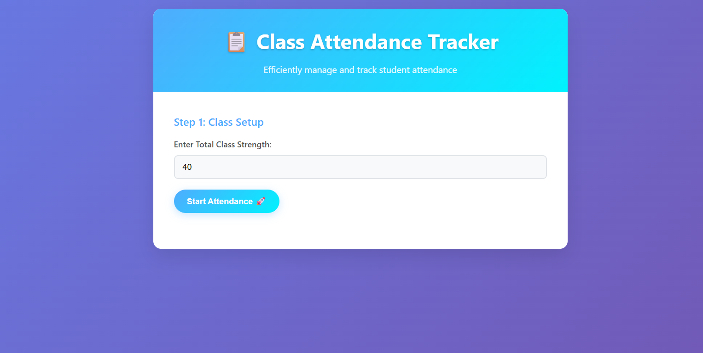
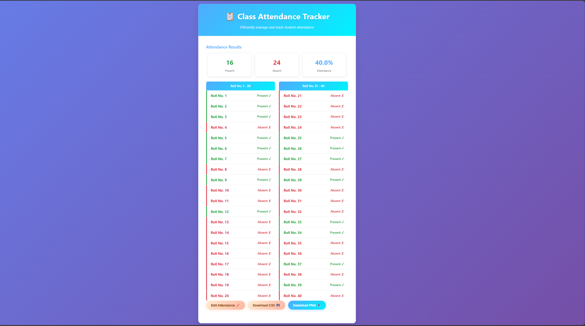
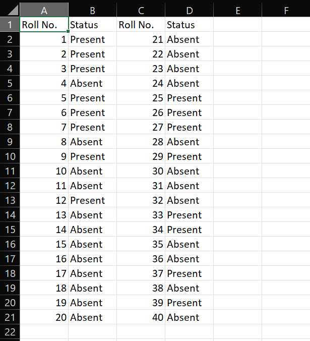
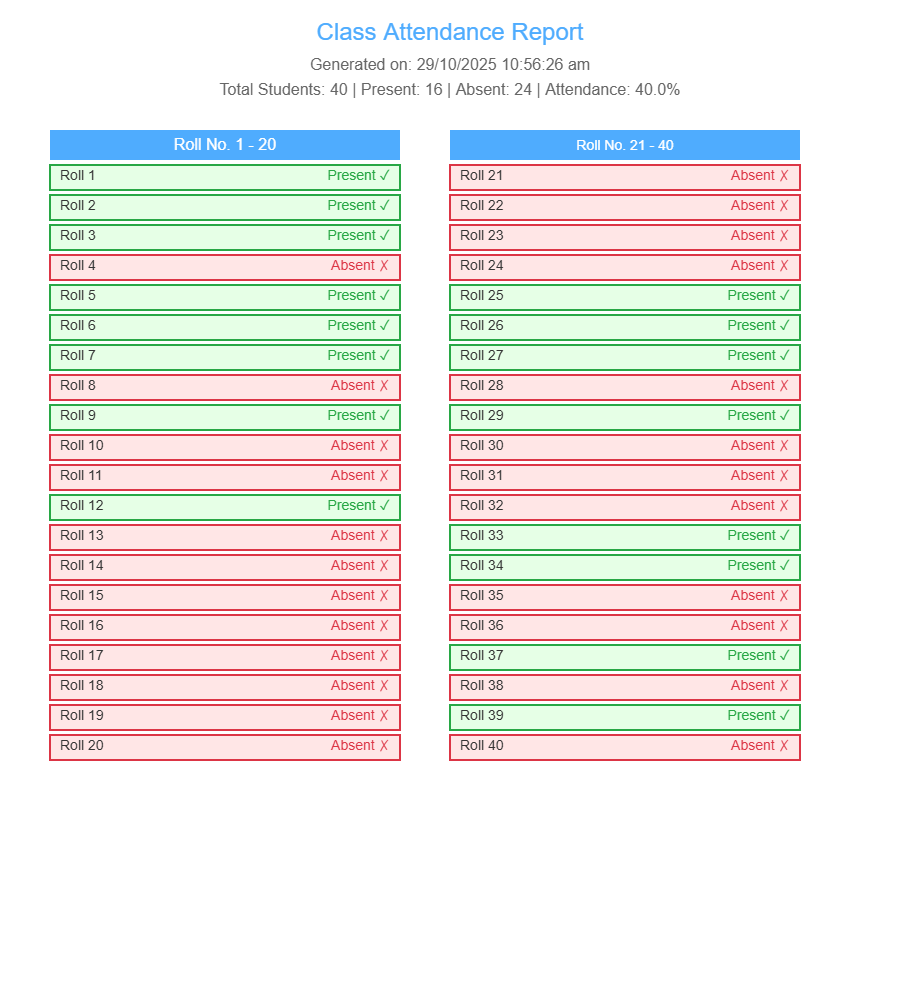

# 🚀 Class Attendance Tracker

## 🌐 Live Demo

You can try the application directly here:
**[Class Attendance Tracker](https://dnyaneshwar-19.github.io/attendence_page/)**

---

## 🧭 Navigation

| [Motivation & Problem Solved](#motivation--problem-solved) | [Features](#features) | [Usage Guide](#usage) | [Screenshots](#screenshots) | [Author](#author) |
| :--------------------------------------------------------: | :-------------------: | :-------------------: | :-------------------------: | :---------------: |

---

An efficient, single-page web application to quickly record student attendance by processing a list of present roll numbers and instantly generating a complete report with statistics and visual status (Present/Absent).

The project is built using HTML, CSS, and JavaScript, following best practices by separating structure, style, and logic into individual files.

---

## 💡 Motivation & Problem Solved

### The Problem with Traditional Attendance: Inefficiency and Bottlenecks

Traditional, serial roll-call attendance creates a chaotic and inefficient bottleneck between lectures. The previous system had several major issues:

1.  **Time Pressure:** The short window between lectures required the current faculty to rush through attendance while the next faculty was waiting.
2.  **Inefficiency of Serial Call:** Calling out every roll number sequentially wasted time and was frustrating for both faculty and students.

### The Solution: The Class Attendance Tracker

This application was created to eliminate this problem by adapting the process to how a faculty member actually scans a room, making it **faster** and **more accurate**:

| Traditional Method                              | **Attendance Tracker Solution**                                                                                                                                                         |
| :---------------------------------------------- | :-------------------------------------------------------------------------------------------------------------------------------------------------------------------------------------- |
| **Serial Roll Call** (1, 2, 3...)               | **Bench-Wise Scanning:** Faculty can quickly note present roll numbers row-by-row or **bench-by-bench**.                                                                                |
| Time wasted calling Roll no of Absent students. | **Input Only Presents:** Faculty only keys in the roll numbers of students who are visibly present, meaning **no need to call the name if the student is absent.**                      |
| Errors from duplicates or incorrect numbers.    | **Automatic Validation:** The system **automatically filters out duplicates** (it only counts once) and **ignores roll numbers outside the class range**, ensuring 100% data integrity. |

By allowing faculty to input attendance based on visual confirmation rather than a rigid serial list, the process is streamlined, taking less time and greatly increasing accuracy.

---

## ✨ Features

- **Quick Setup:** Define the total class strength (e.g., 30, 100).
- **Flexible Input:** Enter present student roll numbers separated by commas, spaces, or newlines.
- **Instant Report:** Automatically calculates total present, total absent, and the overall attendance percentage.
- **Columnar Display:** Attendance results are displayed in easy-to-read columns with a capacity of **20 students per column**.
- **Editing Capability:** Modify the list of present students after the initial report is generated.
- **Download Options:**
    - **Download PNG:** Generate a clean, structured image summary of the attendance report.
    - **Download CSV (Excel Compatible):** Export the raw roll number and status data in a multi-column format (max 20 rows per column).

---

## 💡 Usage

1.  **Step 1: Class Setup**

- Enter the **Total Class Strength** (e.g., `50`).
      - Click the **Start Attendance 🚀** button.

2.  **Step 2: Mark Attendance**

- Enter the roll numbers of the students who are **PRESENT** in the text area. You can list them in any format (e.g., `1, 2, 5, 8, 9` or one number per line).
      - Click the **End Attendance ✓** button.

3.  **Step 3: Review Results**

- The complete report will be displayed, showing the Present, Absent, and Attendance Percentage.
      - The full student list will be displayed in multi-column format.

4.  **Download as CSV (For Excel):**
        Click **Download CSV 💾** to get a file compatible with Excel.

---

## 📸 Screenshots

### 1. Class Strength Input

### 2. Marking Attendence

### 3. Attendence Result

### 4. CSV Dowload

### 5. PNG Download

---

## ✍️ Author

- **Dnyaneshwar V Tupe** - [dnyaneshwar-19](https://github.com/dnyaneshwar-19)
